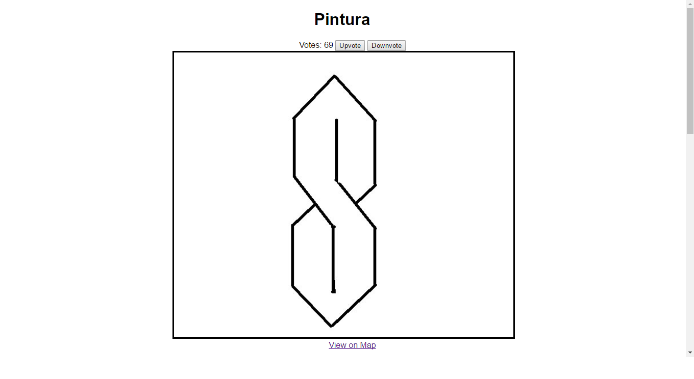
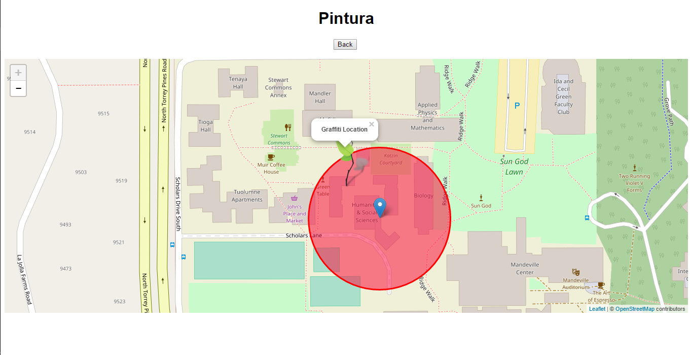
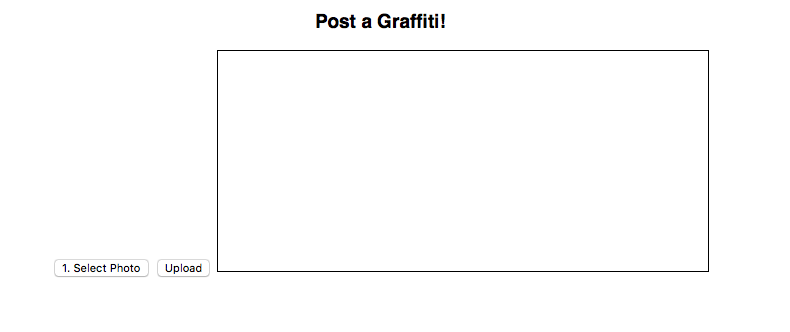

# Description of what each team member has done on the project so far

Tony:
//TODO add it here!

---

Connie:
Added a link to a "Make Posts" page
Implemented a canvas that users can draw on to make posts
Added a photopicker

---

Jorenne:
- Changed homescreen to display hardcoded list view of graffiti instead of map view
- Hardcoded voting buttons on homescreen
- Linked graffiti to hardcoded map view
- Edited map to only display current location and graffiti location

---

Chang:
//TODO add it here!

---

# Screenshots 

and draw on it.

Description: Users can view images of graffiti and click on the link to view its location on the map. They can also draw their own graffiti when they click on the designated link. We also plan to implement the voting functionality, but currently it does not respond.

Description: This screenshot shows a map with the graffiti's location centered. Users can interact with the map and also view their current location.

Description: Our "make a post" page. Here users are able to upload an image

