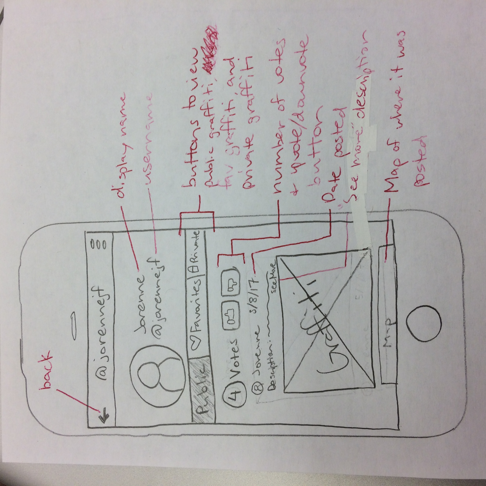

# Paper Prototypes 2

Jorenne:

Description: My prototypes display the UI of the profiles. I made two versions for both mobile and desktop, and they both display the same content. Each profile has public graffiti and favorite graffiti. Private graffiti can only be viewed on your own profile.

---

Connie:

Description: This is a prototype of our "Post Graffiti" page.
The primary interaction depicted here is allowing users to
upload/take a photo. They can then open a color picker and 
select a color to draw on to the photo and make a post.

Image:

---

Tony:

Description:
This is a prototype for the interaction flow from map screen to list screen, and eventually to the commenting screen. This alternative design is quite different from our current app design. In this design, I attempt to connect the map view and list view of graffitis so that the app has more synergy between screen.

Image:

---

Chang:

Description:

