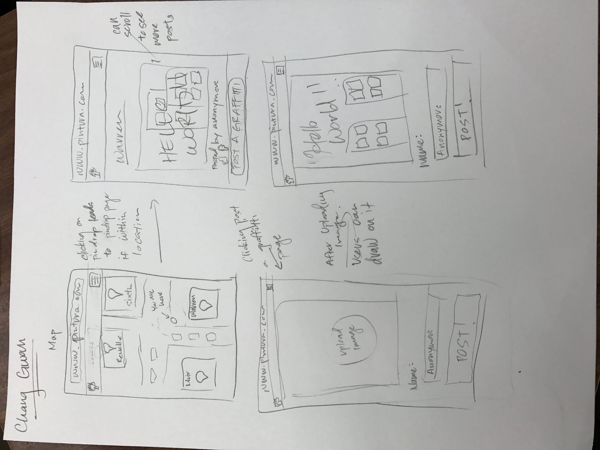
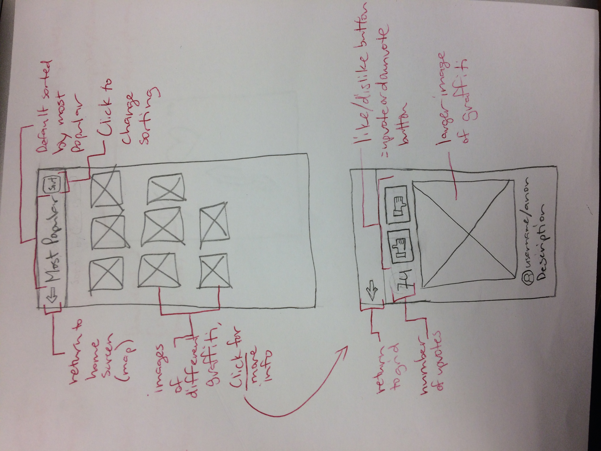

Connie Guan
---

Tony Salim
---

Chang Gwoun
---

Jorenne Flores
---

Description: This prototype shows the home screen of our app, which is a map with the user's current location and locations of graffiti. "View" button allows users to view nearby graffiti in the graffiti page. If no graffiti is nearby, button will be disabled. "Draw" button takes the user to the drawing page. Optional re-center button on top left will take the user back to their current location when clicked. Optional compass points to north and south depending on rotation of phone. Hamburger menu can include user settings, account settings, reporting page, etc.

Description: (Top) This prototype is accessed when the user clicks on "view" from the home screen. It displays an image grid of nearby graffiti. The graffiti is sorted by most popular by default, but they can be arranged in a different order when the user clicks on "sort" on the top right. The user can also click on each image on the grid to view more information about the graffiti, shown in the bottom drawing. (Bottom) The number of upvotes the graffiti has is displayed on the top left. Beside it are the upvote and downvote buttons. More information about the graffiti is shown underneath a much larger image of the graffiti itself.

Description: This prototype is another version of the viewing page. It is meant to replicate a wall of graffiti. Users can scroll right to view other graffiti (indicated by the arrows on the right edge of the screen - I forgot to write that down). Another possible option we can implement with this page is to have users physically move their phones in different directions to view more graffiti (similar to facebook's 360 videos). To view more information, users can tap on a graffiti and a bubble will pop up displaying the number of upvotes, the upvote and downvote buttons, username, description, etc.

Description: This prototype is the drawing page that is accessed when the user clicks "Draw" on the home screen. The majority of the page is dedicated to drawing the user's graffiti, with the available tools on the top. There are buttons for undo/redo, starting over with a new graffiti, changing the brush type (e.g. brush, marker, spray paint), changing the thickness of the brush, and changing the color. The button for changing colors opens up a bubble that shows the user's available colors. Users can buy more colors with points gained from upvoted graffiti; this is our way of motivating users to continue using our app. By default users are given primary colors to start with.
